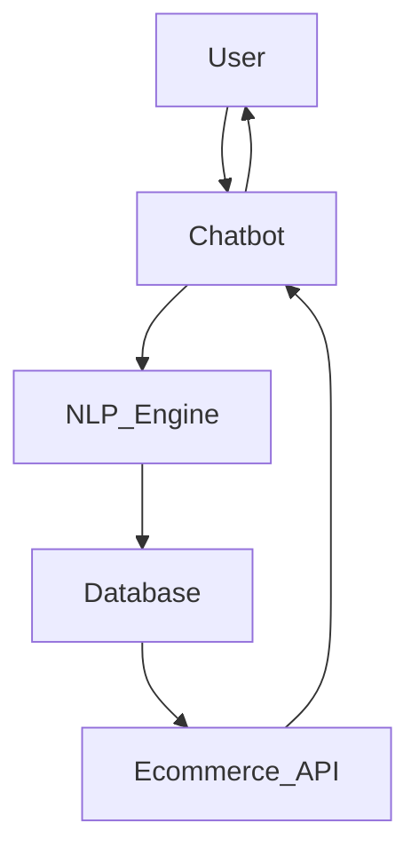

```markdown
# AI Chatbot Documentation

## Table of Contents
1. [Introduction](#introduction)
2. [Project Overview](#project-overview)
3. [Core Features](#core-features)
4. [Technical Requirements](#technical-requirements)
5. [Architecture](#architecture)
6. [User Flow](#user-flow)
7. [Integration](#integration)
8. [Security & Compliance](#security--compliance)
9. [KPIs & Success Metrics](#kpis--success-metrics)
10. [Scalability Plan](#scalability-plan)
11. [Example Conversations](#example-conversations)
12. [Testing and Deployment](#testing-and-deployment)
13. [Future Improvements](#future-improvements)

---

## Introduction
The AI Chatbot is designed to enhance customer experience in the **beauty and cosmetics** industry. It provides intelligent product recommendations, automates customer support, and facilitates seamless interactions with users.

## Project Overview
- **Target Industry:** Beauty & Cosmetics
- **Primary Users:** Online shoppers, beauty customers, and e-commerce store owners
- **Main Objectives:**
  - Provide personalized product recommendations
  - Automate order tracking and customer inquiries
  - Increase cross-selling and up-selling opportunities
  - Improve engagement through natural conversations

## Core Features
### 1. Intelligent Product Recommendations
- Dynamic questioning to understand customer needs (e.g., skin type, budget, desired effect)
- AI-driven matching to suggest the best beauty products

### 2. Order Management
- Order tracking by fetching real-time order status
- Easy modifications (address change, cancellation, etc.)

### 3. Cross-Selling & Up-Selling
- Suggests complementary products based on customer purchases
- Provides bundle deals for enhanced shopping experience

### 4. Dynamic FAQ & Customer Support
- Answers common customer inquiries (shipping, return policy, etc.)
- Escalates complex queries to human support

### 5. Natural Conversational Experience
- Uses NLP to interact in a human-like manner
- Supports multi-turn conversations

## Technical Requirements
### No-Code Tools
- **Chatbot Platform:** ManyChat, Chatfuel, or Landbot
- **Automation:** Make (Integromat) / Zapier
- **Database:** Google Sheets / Airtable
- **E-commerce Integration:** Shopify, WooCommerce APIs

### AI & NLP
- **Pre-built NLP models:** OpenAI GPT, Dialogflow
- **Custom Intent Training:** Dialogflow or Rasa (for future scaling)

### Hosting & Deployment
- **Frontend:** Embedded chat widget for Shopify/WooCommerce
- **Backend Automation:** Make/Zapier for API calls

## Architecture


## User Flow
1. **User initiates chat** (e.g., "I need a moisturizer for dry skin")
2. **Chatbot asks refining questions** ("What’s your budget? Do you prefer fragrance-free?")
3. **Chatbot fetches product recommendations** from the database
4. **User selects a product** and adds it to the cart
5. **Chatbot offers additional product suggestions** (cross-sell/up-sell)
6. **User checks order status** or inquires about support
7. **Chatbot handles FAQ or escalates issue** to human support

## Integration
### E-commerce
- **Shopify API:** Retrieve order status, product details
- **WooCommerce API:** Fetch inventory, update orders

### Payment & Checkout
- **Stripe API:** Secure payment processing
- **PayPal API:** Alternative payment method

### Customer Engagement
- **Facebook Messenger API** (for chatbot deployment on social media)
- **WhatsApp Business API** (for direct communication)

## Security & Compliance
- **Data Privacy:** Ensure compliance with GDPR, CCPA regulations
- **User Data Storage:** Store only necessary data with encryption
- **Permissions & Access Control:** Restrict access to sensitive data

## KPIs & Success Metrics
### Key Performance Indicators
1. **Click-through rate (CTR) on recommendations** – Measure engagement with suggested products
2. **Conversion rate** – Track how many chatbot interactions lead to purchases
3. **Response time** – Ensure chatbot provides quick and efficient responses

## Scalability Plan
- **Database Optimization:** Use indexing and caching for faster query execution
- **Load Balancing:** Implement cloud-based scaling solutions
- **Multi-Language Support:** Prepare for localization and expansion to new markets

## Example Conversations
### Product Recommendation Scenario
**User:** "I need a moisturizer for dry skin."
**Chatbot:** "What’s your budget? Do you prefer fragrance-free options?"
**User:** "Under $30, and yes, fragrance-free."
**Chatbot:** "Here are the top-rated fragrance-free moisturizers under $30: [Product 1], [Product 2], [Product 3]. Would you like to add one to your cart?"

### Order Tracking Scenario
**User:** "Where is my order #12345?"
**Chatbot:** "Let me check… Your order is currently out for delivery and should arrive today by 6 PM. Would you like to receive real-time tracking updates?"

## Testing and Deployment
### Testing
- **Functional Testing:** Verify chatbot responses, NLP accuracy
- **User Testing:** Collect feedback from beta testers
- **Load Testing:** Ensure chatbot can handle multiple users simultaneously

### Deployment
- **Soft Launch:** Deploy chatbot on a test store
- **Full Rollout:** Integrate with real customers and monitor performance

## Future Improvements
- **AI-driven adaptive learning** (improving responses over time)
- **Voice command support** (Google Assistant, Alexa)
- **Enhanced personalization** (user preferences saved for future chats)
- **Multilingual support** (expansion beyond English)

---

### Author
**Project Lead:** [MATT ZADE]
**Date:** [2025-04-04]
```
